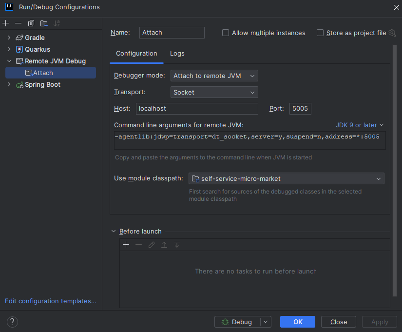
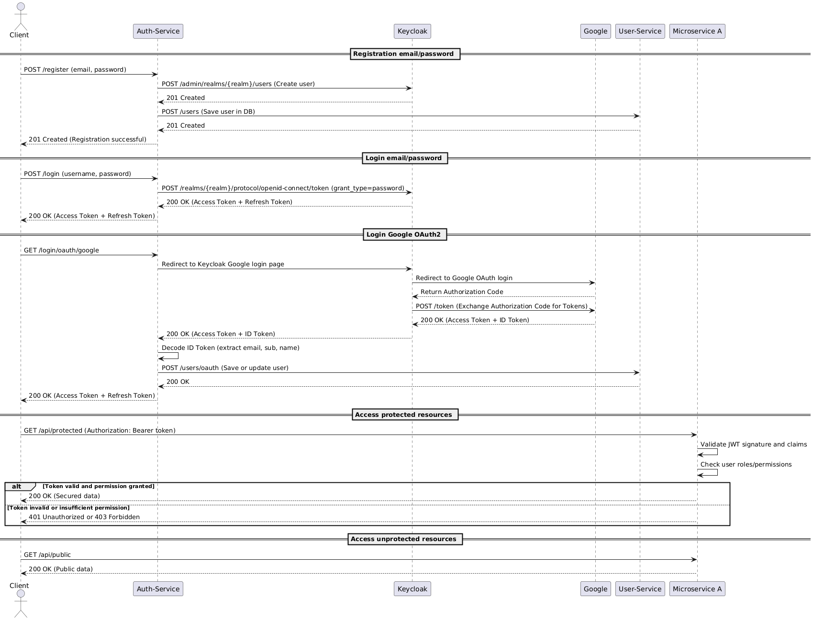

- [Requirements](#requirements)
- [Getting started](#getting-started)
    * [Run](#run)
    * [Debug](#debug)
    * [Postman](#postman)
- [Keycloak](#keycloak)
- [Coding standards](#coding-standards)
    * [Naming](#naming)
    * [Structure](#structure)
    * [Comments](#comments)
        + [JavaDoc](#javadoc)
    * [Endpoints](#endpoints)
- [Testing](#testing)
    * [Integration Tests](#integration-tests)
    * [Example](#example)

<small><i><a href='http://ecotrust-canada.github.io/markdown-toc/'>Table of contents generated with markdown-toc</a></i></small>

## Requirements
- Java 21

## Getting started
### Run
1. Change to backend root `cd backend`
2. Start the DB `docker compose -p "micro-market-db" up -d`
3. Build common project `./gradlew.bat :common:build`
4. Run microservice `./gradlew.bat :{SERVICENAME}:bootRun`

> ### Debug
> 1. Run microservice with `./gradlew.bat :{SERVICENAME}:bootRun --debug-jvm`
> 2. Add config for debugger 
> 3. Run debugger configuration

### Postman
https://www.postman.com/lively-crater-269365/self-service-micro-market/overview

## Keycloak

1. Create the realm `self-service-micro-market`
2. Create client 'postman-client'
3. Create roles
4. Create users and assign roles (USER, ADMIN)
5. Populate `.env` and `auth-service/application.properties` (clientId find in request in postman `DEBUG keycloak clients`, don't forget to update admin token in headers with `DEBUG keycloak admin token`)

## Coding standards
### Naming
| Object               | Naming Rule       | Example                      |
|----------------------|-------------------|------------------------------|
| Files                | PascalCase        | FooBar.java                  |
| Packages             | lowercase         | com.micromarket.core_service |
| Components / Classes | PascalCase        | FooBar                       |
| Variables            | camelCase         | nameAndDescription           |
| Constants            | UPPER_SNACKE_CASE | VERY_IMPORTANT_CONSTANT      |    
| Methods              | camelCase         | doSomething                  |

### Structure
The code in our spring application is structured and divided based on the resources. A package consists of a repository, service (interface and implementation), controller, model, modelDTO and mapper for the model:


### Comments

#### JavaDoc
To write comments in our Java Code we use JavaDoc. More information can be found [here](#https://www.baeldung.com/javadoc)


### Endpoints
To document our endpoints we're going to use swagger:
[Self Service Micro Market](https://app.swaggerhub.com/apis/JeromeTownsend/MiniMarket/1.0.0)

## Testing
### Integration Tests
- Focused on core business logic in the service layer.
- Use real dependencies like an in-memory H2 database.
- Written with JUnit, typically without mocks.
- Ensure services and repositories work together correctly.
- At least one positive test case per method is required.
### Example
* The test data should be seeded with sql script
```
@Sql(scripts = "/test-seed.sql")
@Test
public void testGetUserById() {
    // Given
    String name = "Alice";
    String email = "alice@example.com";
    User createdUser = userService.createUser(name, email);

    // When
    User retrievedUser = userService.getUserById(createdUser.getId());

    // Then
    assertNotNull(retrievedUser);
    assertEquals(createdUser.getId(), retrievedUser.getId());
    assertEquals(createdUser.getName(), retrievedUser.getName());
    assertEquals(createdUser.getEmail(), retrievedUser.getEmail());
}
```