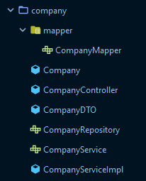
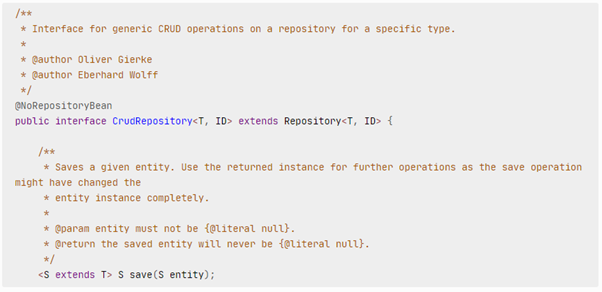

## Requirements
- Java 21

## Getting started
To run a specific service
1. Change to backend root `cd backend`
2. Build common project `./gradlew.bat :common:build`
3. Run microservice `./gradlew.bat :{SERVICENAME}:bootRun`

## Coding standards
### Naming
| Object               | Naming Rule       | Example                      |
|----------------------|-------------------|------------------------------|
| Files                | PascalCase        | FooBar.java                  |
| Packages             | lowercase         | com.micromarket.core_service |
| Components / Classes | PascalCase        | FooBar                       |
| Variables            | camelCase         | nameAndDescription           |
| Constants            | UPPER_SNACKE_CASE | VERY_IMPORTANT_CONSTANT      |    
| Methods              | camelCase         | doSomething                  |

### Structure
The code in our spring application is structured and divided based on the resources. A package consists of a repository, service (interface and implementation), controller, model, modelDTO and mapper for the model:

### Comments

#### JavaDoc
To write comments in our Java Code we use JavaDoc. More information can be found [here](#https://www.baeldung.com/javadoc)

### Endpoints
To document our endpoints we're going to use swagger
**TODO** ADD LINK